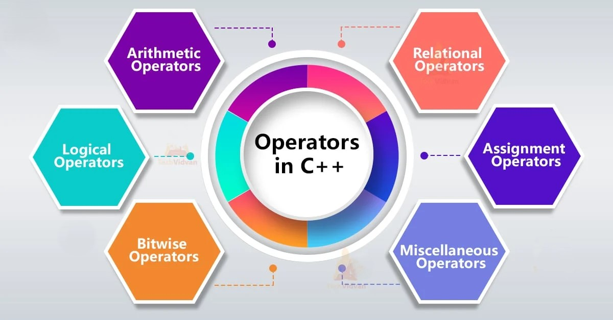

<!--unit 1 starts-->


|Content|
|:-----:|
|[Introduction to Computer Fundamentals](#introduction-to-computer-fundamentals)|
|[Basics of Programming Idea of Algorithm](#basics-of-programming-idea-of-algorithm)|
|[Operators](#operators)|
|[Control Structures](#control-structures)|
|[Functions](#functions)|
|[Arrays](#arrays)|
|[Structures and Unions Structures](#structures-and-unions-structures)|


#  Introduction to Computer Fundamentals 


## 1. **Input and Output Devices**

#### **Input Devices**:
Input devices allow users to enter data into a computer system for processing.

1. **Keyboard**:


   - **Function**: It’s the primary method of input for text and control commands. The keys are mapped to unique codes (e.g., ASCII or Unicode), which are sent to the computer’s processor.
   - **Working**: The keyboard works through electrical circuits that close when a key is pressed, sending a signal to the CPU. Keyboards use either **mechanical switches** (e.g., Cherry MX switches) or **membrane technology**.
   - **Types**: 
     - **Mechanical Keyboards**: Each key has its own switch mechanism, often providing tactile feedback.
     - **Membrane Keyboards**: A more cost-effective design where a membrane layer detects key presses.

2. **Mouse**:


   - **Function**: Used to point, select, and interact with graphical elements on the screen.
   - **Working**: A **laser or optical sensor** detects movement over a surface and sends data to the CPU. The mouse may have **buttons** for selection and scrolling.
   - **Types**:
     - **Mechanical Mouse**: Uses a ball to detect movement.
     - **Optical Mouse**: Uses an LED light to detect motion.
     - **Laser Mouse**: Uses a laser for better precision, especially on reflective surfaces.

3. **Scanner**:


   - **Function**: Converts physical documents or images into digital data.
   - **Working**: A **scanner** uses **light sensors** to scan an image or text. The light is reflected from the document and captured by the scanner, converting the image into a digital format (bitmap or vector).
   - **Types**:
     - **Flatbed Scanner**: A glass surface where the document is placed, and the scanner head moves across.
     - **Handheld Scanner**: Portable and used for scanning smaller sections of text or images.
     - **3D Scanner**: Captures three-dimensional objects by scanning with lasers or structured light.

4. **Microphone**:


   - **Function**: Captures sound input and converts it into electrical signals.
   - **Working**: Microphones work based on **piezoelectric sensors** or **capacitors**. Sound waves cause the sensor or diaphragm to vibrate, converting sound to an analog signal, which is then digitized by an **ADC (Analog-to-Digital Converter)**.
   - **Types**:
     - **Dynamic Microphones**: Use a diaphragm and coil to convert sound to an electrical signal.
     - **Condenser Microphones**: Use a capacitor to convert sound to an electrical charge.

5. **Webcam**:


   - **Function**: Captures real-time video or still images.
   - **Working**: Webcams use **CMOS (Complementary Metal-Oxide-Semiconductor)** or **CCD (Charge-Coupled Device)** sensors to capture visual data. The captured image is then sent to the computer and may be processed or displayed.
   - **Types**:
     - **USB Webcam**: Connects via USB and is the most common type.
     - **Integrated Webcam**: Found in laptops and built-in devices.

6. **Touchscreen**:


   - **Function**: A combination of input and output, allowing users to interact directly with what is displayed on the screen.
   - **Working**: It detects touch via **capacitive** (electrostatic field changes when the screen is touched) or **resistive** (physical pressure from a finger or stylus) methods.
   - **Types**:
     - **Capacitive Touchscreen**: Detects changes in the electrical field when touched by a finger.
     - **Resistive Touchscreen**: Responds to pressure and requires two layers of material to detect touch.

### **Output Devices**:
Output devices allow computers to communicate results to the user in various formats (visual, audio, printed).

1. **Monitor**:


   - **Function**: Displays visual output from the computer, such as graphical user interfaces, images, and videos.
   - **Working**: Modern monitors use **LCD (Liquid Crystal Display)** or **LED (Light Emitting Diode)** technology. The display is created by manipulating liquid crystals to either block or allow light to pass through.
   - **Types**:
     - **LCD Monitors**: Use a backlight to illuminate liquid crystals.
     - **LED Monitors**: Use LEDs for both backlighting and, in some cases, for the pixels themselves (OLED).
     - **OLED Monitors**: Use organic light-emitting diodes to create individual light sources at each pixel.

2. **Printer**:


   - **Function**: Converts digital information (documents, images) into physical form on paper.
   - **Working**: Printers translate digital data into print by applying ink or toner on paper. **Laser printers** use a laser to form a pattern on a drum, which attracts toner, while **inkjet printers** spray ink droplets on paper.
   - **Types**:
     - **Inkjet Printer**: Uses liquid ink droplets to print images or text.
     - **Laser Printer**: Uses a laser beam to create an electrostatic image on a drum, which attracts toner powder.

3. **Speakers**:


   - **Function**: Output audio signals as sound.
   - **Working**: Converts digital audio signals into sound by creating vibrations using a diaphragm or speaker cone. The signal is passed through an **amplifier**, which drives the speaker.
   - **Types**:
     - **Active Speakers**: Include built-in amplifiers.
     - **Passive Speakers**: Require an external amplifier for audio playback.

4. **Projector**:


   - **Function**: Projects visual output onto a large surface (e.g., wall or screen) for presentations or entertainment.
   - **Working**: Projectors use a light source (e.g., **bulb**, **laser**) to illuminate a display panel (e.g., **LCD**, **DLP**), and the image is then projected onto a surface using lenses.
   - **Types**:
     - **DLP Projector**: Uses Digital Light Processing (micromirrors) to create an image.
     - **LCD Projector**: Uses liquid crystal displays to create an image, requiring three panels (one for each primary color).


## 2. **Memory and Storage Devices**

### **Memory** (Temporary Storage):
Memory is used by the CPU to store data and instructions that are in use by running programs. It is **volatile**, meaning it loses data when power is turned off.

- **Primary Memory**:
  - **RAM (Random Access Memory)**: A fast-access memory used for temporarily storing active programs and data. There are two main types:
    - **DRAM (Dynamic RAM)**: Stores data in capacitors that must be refreshed regularly.
    - **SRAM (Static RAM)**: Uses flip-flops to store data, faster and more reliable than DRAM but more expensive.
  - **Cache Memory**: A small but extremely fast memory that stores frequently accessed data or instructions. It helps improve CPU performance by reducing the time to access data from the main memory (RAM).
    - **L1 Cache**: Smallest and fastest cache, located directly in the CPU.
    - **L2 Cache**: Larger and slightly slower than L1, but still faster than RAM.
    - **L3 Cache**: Shared by multiple CPU cores and slower than L1 and L2.

- **Registers**:
  - Small, fast storage locations within the CPU that hold data needed for immediate operations. They store the intermediate results of computations.

### **Storage Devices** (Permanent Storage):
Storage devices keep data even when the computer is turned off. These devices provide non-volatile storage for the operating system, applications, and user data.

- **Hard Disk Drive (HDD)**:
  - Consists of spinning magnetic platters, which store data. **Read/Write heads** move across the platters to access data.
  - **Advantages**: Large storage capacity and lower cost per GB.
  - **Disadvantages**: Slower access speeds due to mechanical parts.
  
- **Solid-State Drive (SSD)**:
  - Uses **flash memory** (NAND) to store data. SSDs have no moving parts and are faster, more durable, and consume less power than HDDs.
  - **Advantages**: Faster read/write speeds, better reliability.
  - **Disadvantages**: Higher cost per GB compared to HDDs.

- **Optical Discs (CD/DVD/Blu-ray)**:
  - Use a laser to read and write data on reflective discs. The data is stored as patterns of pits and lands on the surface of the disc.
  - **Advantages**: Portable, good for media storage, and long shelf life.
  - **Disadvantages**: Slower read/write speeds and limited storage compared to HDDs or SSDs.

- **USB Flash Drives**:
  - Portable devices that use flash memory for storage. They are commonly used for transferring files between computers.
  - **Advantages**: Portable, relatively inexpensive, no moving parts.
  - **Disadvantages**: Smaller storage capacity compared to HDDs and SSDs.

- **Cloud Storage**:
  - A remote storage solution that allows data to be stored on servers maintained by cloud providers.
  - **Advantages**: Accessible from anywhere, scalable, provides backup and redundancy.
  - **

Disadvantages**: Dependent on internet access, security and privacy concerns.


## 3. **Block Diagram of Computer System**

To visualize the architecture of a computer, the **block diagram** typically consists of the following components:


- **CPU (Central Processing Unit)**:
  - **Control Unit (CU)**: The CU orchestrates the execution of instructions, directs data flow, and controls the sequence of operations.
  - **Arithmetic and Logic Unit (ALU)**: The ALU is responsible for carrying out arithmetic operations (e.g., addition, subtraction) and logic operations (e.g., AND, OR).

- **Memory**:
  - **Primary Memory** (RAM and Cache): Stores active programs and data that the CPU is currently using.
  - **Secondary Memory**: Non-volatile storage for long-term data (e.g., HDD, SSD).

- **Input/Output**: 
  - **Input devices** allow the user to interact with the computer (e.g., keyboards, mice).
  - **Output devices** display or communicate the results of computations to the user (e.g., monitors, printers).


## 4. **Types of Software**

### **System Software**:
System software includes the operating system and various utility programs that manage the hardware and provide a platform for running application software.

- **Operating System (OS)**:
  - **Function**: The OS acts as an intermediary between hardware and software, providing essential services such as process management, memory management, security, file system management, and user interaction.
  - **Types**:
    - **Monolithic Kernel**: All OS services (e.g., process management, hardware drivers) are part of the same large code base.
    - **Microkernel**: OS services are modularized into separate processes for better fault isolation and easier updates.
    - **Hybrid Kernel**: A mix of monolithic and microkernel approaches (e.g., Windows NT).
  
- **Utility Software**:
  - These are programs designed to perform a specific task related to system maintenance or optimization. Examples include disk cleanup, antivirus software, file compression tools, etc.

### **Application Software**:
Application software is designed to help users complete specific tasks, such as word processing, web browsing, or gaming.

- **Productivity Software**:
  - Includes tools like word processors (e.g., Microsoft Word), spreadsheet applications (e.g., Microsoft Excel), and presentation software (e.g., Microsoft PowerPoint).
  
- **Media Software**:
  - Designed for creating, editing, and viewing audio and visual content. Examples include photo editing software like Adobe Photoshop, video editing software like Final Cut Pro, and media players like VLC.


## 5. **Operating System with Its Types**

Operating systems manage the computer’s resources and provide an environment in which applications can run.

- **Single-User, Single-Tasking OS**:
  - Example: **MS-DOS** — can only execute one task at a time. It was used in early personal computers.

- **Single-User, Multi-Tasking OS**:
  - Example: **Windows** or **macOS** — allows one user to run multiple programs simultaneously.

- **Multi-User OS**:
  - Example: **Linux**, **Unix** — supports multiple users accessing the system simultaneously, typically used in server environments.

- **Real-Time OS (RTOS)**:
  - Designed for systems that require strict timing constraints, such as embedded systems, industrial machines, and medical devices.
  - Example: **VxWorks**, **FreeRTOS**.


## 6. **Compiler, Interpreter, Assembler, Linker, Loader**

### **Compiler**:

- A **compiler** translates high-level programming code into machine code that the computer can execute. It does this in one go, and the resulting machine code can be executed multiple times.
- Example: **GCC** for C/C++.

### **Interpreter**:

- An **interpreter** translates code into machine code **line by line** during execution. Unlike a compiler, it doesn’t produce a separate executable file.
- Example: **Python Interpreter**, **JavaScript** engines.

### **Assembler**:
- An **assembler** converts assembly language code into machine code. Assembly language is low-level code that directly interacts with hardware.
- Example: **MASM**, **GAS**.

### **Linker**:
- A **linker** combines various object files generated by the compiler into a single executable file, resolving references between them.
- Example: **GNU Linker (ld)**.

### **Loader**:
- A **loader** loads the executable file into memory and prepares it for execution. It handles tasks like memory allocation and loading libraries.
- In modern OS, the loader may also handle **dynamic linking** during runtime.

---

<!--unit 1 ends-->
<!--unit 2 starts-->

# Basics of Programming Idea of Algorithm


## Step 1: **Understanding the Problem**

This is the foundation of problem-solving. Carefully read the problem and try to restate it in your own words to clarify what’s being asked. Identify any hidden requirements, edge cases, or special scenarios. For example, if a problem involves calculating the sum of numbers, determine if there are specific conditions such as only summing positive numbers or skipping certain values. This initial analysis ensures that you comprehend every detail of the problem before moving forward.

**Example**: If a problem asks to find the largest number in a list, ensure you understand whether the list can contain negative numbers, or if it may be empty.


## Step 2: **Identify Inputs and Outputs**

Identify the inputs (data you have) and outputs (results you need to produce). This helps you organize the problem and determine what data to collect or calculate.

**Example**: In a problem where you need to calculate the area of a rectangle, the inputs would be the length and width, and the output would be the area.


## Step 3: **Develop the Logic**

Logic development is crucial as it lays the groundwork for solving the problem systematically. Break down the solution into small, manageable steps. For example, if the problem is to find the factorial of a number, the logic would involve multiplying all integers from 1 up to the number. Identify any conditions, loops, or sequences needed to complete the task.

**Example**: To find the maximum number in an array, start by assuming the first element is the largest. Then, compare each element with the current maximum and update it if a larger value is found. Repeat this until the end of the array.


## Step 4: **Plan the Solution**

This step involves representing your solution in a structured format, like an algorithm, flowchart, or pseudocode.

### **Algorithm**

An algorithm is a step-by-step list of instructions for solving a problem. Algorithms are abstract and not tied to any programming language, so they are often written in plain English.

**Example Algorithm** (to find the maximum of two numbers):

1. Take two numbers as input.
2. Compare the two numbers.
3. If the first number is greater, return it.
4. Otherwise, return the second number.

### **Flowchart**

A flowchart is a visual representation of an algorithm. It uses shapes like rectangles (for processing steps), diamonds (for decision points), and ovals (for start/end points). Flowcharts help visualize the flow of control in the problem-solving process, making complex logic easier to understand.

**Example Flowchart** (for finding the maximum of two numbers):

1. Start (oval).
2. Input numbers (parallelogram).
3. Decision box: Is the first number greater than the second?
4. If yes, print the first number (output box).
5. If no, print the second number.
6. End (oval).

### **Pseudocode**

Pseudocode is a high-level, human-readable description of an algorithm. It combines structured English with logical steps to describe the solution, often resembling programming languages without strict syntax.

**Example Pseudocode** (for finding the maximum of two numbers):
```
BEGIN
  INPUT num1, num2
  IF num1 > num2 THEN
      OUTPUT num1
  ELSE
      OUTPUT num2
  END IF
END
```


## Step 5: **Implement the Solution in C++**

After developing the solution, you can write it in C++. Here’s a simple program structure:

```cpp
#include <iostream>
using namespace std;

int main() {
    int num1, num2;
    cout << "Enter two numbers: ";
    cin >> num1 >> num2;
    
    if (num1 > num2) {
        cout << "The maximum number is " << num1;
    } else {
        cout << "The maximum number is " << num2;
    }
    
    return 0;
}
```

This code takes two numbers as input and outputs the larger of the two. After writing your code, compile and execute it to verify the solution.

### **Compile and Execute a C++ Program**

To compile the program:
1. Use a C++ compiler like `g++`. In the terminal, type `g++ program.cpp -o program`.
2. Run the program by typing `./program`.


## Step 6: **Analyze Character Set, Tokens, Data Types, and Errors in C++**

### **Character Set**

In C++, the character set includes letters (`a`-`z`, `A`-`Z`), digits (`0`-`9`), and special characters like `+`, `-`, `*`, `/`, `;`, and `#`. They are the building blocks of the code.

### **Tokens**

Tokens are the smallest units in C++ and include:
- **Identifiers**: Names for variables, functions, etc. (e.g., `int`, `myFunction`).
- **Keywords**: Reserved words with specific meanings, like `int`, `return`, `if`, `else`.
- **Literals**: Fixed values such as `10`, `3.14`, `'a'`.
- **Operators**: Symbols for operations, like `+`, `-`, `*`, `/`.
- **Constants**: Unchangeable values declared using `const`.

### **Data Types**

Data types specify the type of data a variable can hold:
- **Primitive types**: `int`, `float`, `double`, `char`, `bool`
- **Derived types**: Arrays, pointers, references

### **Errors in C++**

Errors can be:

- **Syntax Errors**: Violations of C++ syntax, like missing semicolons.
- **Logical Errors**: The code runs but gives incorrect results due to faulty logic.
- **Runtime Errors**: Errors that occur during program execution, like division by zero.

---
<!--algorithm ends-->
<!--operator starts-->

# Operators



## 1. **Assignment Operators**

Assignment operators are used to assign values to variables in C++. The basic assignment operator is `=`, which takes the value on the right side and assigns it to the variable on the left. Compound assignment operators like `+=`, `-=`, `*=`, `/=`, and `%=` are shorthand for performing an operation and then assigning the result to the variable on the left.

For example, `x += 5` is equivalent to `x = x + 5`. This operation first adds 5 to the value of `x` and then stores the result back in `x`. These compound operators are helpful for writing more concise code, especially in loops or repetitive calculations. Additionally, they improve readability, making it easier to see that a particular variable is being incremented or modified by a set amount.


## 2. **Numeric Operators**

Numeric (or arithmetic) operators perform fundamental arithmetic operations on numeric values:

- `+` (Addition): Adds two numbers.
- `-` (Subtraction): Subtracts the second number from the first.
- `*` (Multiplication): Multiplies two numbers.
- `/` (Division): Divides the first number by the second. It’s important to note that in integer division, any fractional part is discarded.
- `%` (Modulus): Finds the remainder of the division of two integers.

These operators are the basis for most mathematical calculations in programs. When using these operators, keep in mind the types of the operands; for instance, dividing two integers results in an integer output, which could lead to data loss if not handled carefully.

**Example**: If `a = 10` and `b = 3`, then `a / b` results in `3`, as the decimal part is truncated. To get a precise result, at least one operand should be a floating-point number (e.g., `a / 3.0` gives `3.33`).


## 3. **Prefix and Postfix Operators**

Prefix (`++x`, `--x`) and postfix (`x++`, `x--`) operators are used for incrementing or decrementing values. The difference between them is when the increment or decrement happens relative to the value being used:

- **Prefix (`++x` and `--x`)**: The value is incremented or decremented before it’s used in the expression.
- **Postfix (`x++` and `x--`)**: The value is used in the expression first, then incremented or decremented.

**Example**: 
```cpp
int x = 5;
int y = ++x; // y is 6, x is incremented first, then assigned to y
int z = x++; // z is 6, x is assigned to z first, then incremented
```

The choice between prefix and postfix affects the order of operations and can impact performance in more complex operations (e.g., loops).


## 4. **Binary Number System**

The binary number system represents values using only `0` and `1`. In C++, binary values are often used for low-level operations, particularly in bitwise manipulation. Each bit in a binary number corresponds to a power of 2, starting from `2^0` at the rightmost bit. Binary is fundamental for understanding how computers store and process data at the hardware level.

**Example**: The binary equivalent of decimal `5` is `101`.


## 5. **Bitwise Operators**

Bitwise operators perform operations directly on the binary representations of numbers. These operators are:

- `&` (AND): Sets each bit to `1` only if both bits are `1`.
- `|` (OR): Sets each bit to `1` if one of the bits is `1`.
- `^` (XOR): Sets each bit to `1` only if the bits are different.
- `~` (NOT): Inverts all bits.
- `<<` (Left Shift): Shifts bits to the left, adding zeros on the right.
- `>>` (Right Shift): Shifts bits to the right, removing bits on the left.

Bitwise operators are useful in low-level programming, where you might need to manipulate individual bits for tasks like optimizing memory usage or implementing flags.

**Example**: The expression `5 & 3` translates to `101 & 011` in binary, which results in `001` or decimal `1`.


## 6. **Logical Operators**

Logical operators are used to evaluate boolean expressions and control program flow:

- `&&` (AND): True if both operands are true.
- `||` (OR): True if at least one operand is true.
- `!` (NOT): Inverts the truth value of the operand.

These operators are essential for conditional statements like `if` and `while`. They allow you to combine multiple conditions to control the logic flow of your program.

**Example**: If `x = 5` and `y = 10`, the condition `(x > 0 && y > 5)` evaluates to `true`.


## 7. **Relational Operators**

Relational operators compare two values:

- `==` (Equal to): True if both operands are equal.
- `!=` (Not equal to): True if operands are not equal.
- `>` (Greater than), `<` (Less than)
- `>=` (Greater than or equal to), `<=` (Less than or equal to)

These operators return boolean values and are used in decision-making constructs. 


## 8. **Short-Circuit Operators**

In C++, logical operators `&&` and `||` are short-circuit operators. This means that they stop evaluating as soon as the final result is determined.

**Example**: For `(x > 0 && y > 5)`, if `x > 0` is `false`, the program will not evaluate `y > 5` because the entire expression is already `false`. This behavior helps optimize performance, especially in complex conditions.


## 9. **sizeof Operator**

The `sizeof` operator returns the size (in bytes) of a variable or data type. This is especially useful in memory management and understanding the architecture of the data structures you’re working with.

**Example**:
```cpp
cout << sizeof(int); // Prints the size of an integer on the current system
```


## 10. **Operator Precedence and Associativity**

Operator precedence determines the order in which operators are evaluated. For instance, multiplication has higher precedence than addition, so `3 + 4 * 2` is evaluated as `3 + (4 * 2)`. Associativity determines the order when two operators have the same precedence (e.g., `+` and `-` have left-to-right associativity).

Understanding precedence and associativity is critical to writing accurate expressions and avoiding bugs due to unexpected evaluations.


## 11. **Type Conversion**

Type conversion is the process of converting a variable from one data type to another. There are two types:

- **Implicit Conversion**: Automatically done by the compiler, such as converting `int` to `float`.
- **Explicit Conversion (Casting)**: Manually converting types using cast operators like `(int)`, `static_cast<int>`, or `dynamic_cast`.

**Example**:
```cpp
int a = 5;
float b = 3.2;
float result = a + b; // Implicitly converts 'a' to float for addition
```

Explicit type conversion is useful when you need to ensure that an expression is evaluated in a specific data type.

<!--operators ends-->
---

# Control Structures 


## 1. **Decision-Making Statements**

Decision-making statements allow the program to take different actions based on conditions. In C++, there are several ways to handle conditions:

### **if Statement**

The `if` statement executes a block of code only if a specified condition is true. It’s one of the simplest decision-making statements.

**Syntax**:
```cpp
if (condition) {
    // code to execute if condition is true
}
```

**Example**:
```cpp
int age = 20;
if (age >= 18) {
    cout << "You are eligible to vote.";
}
```

In this example, the message will only display if `age` is greater than or equal to 18.

### **if-else Statement**

The `if-else` statement provides an alternative path if the condition is false. This is useful for binary conditions (e.g., true/false, yes/no).

**Syntax**:
```cpp
if (condition) {
    // code if condition is true
} else {
    // code if condition is false
}
```

**Example**:
```cpp
int age = 16;
if (age >= 18) {
    cout << "You are eligible to vote.";
} else {
    cout << "You are not eligible to vote.";
}
```

In this case, if `age` is less than 18, the else block will execute.

### **Conditional Operator (?:)**

The conditional operator, also known as the ternary operator, is a shorthand for an `if-else` statement. It evaluates a condition and returns one of two values depending on the outcome.

**Syntax**:
```cpp
(condition) ? expression_if_true : expression_if_false;
```

**Example**:
```cpp
int age = 20;
string result = (age >= 18) ? "Eligible" : "Not eligible";
cout << result;
```

This code uses the ternary operator to assign a value to `result` based on `age`.

### **switch Statement**

The `switch` statement allows multi-way branching based on the value of a single variable or expression. It’s often used when you have multiple conditions based on a single variable.

**Syntax**:
```cpp
switch (variable) {
    case value1:
        // code to execute if variable == value1
        break;
    case value2:
        // code to execute if variable == value2
        break;
    // more cases
    default:
        // code to execute if none of the cases match
}
```

Each `case` represents a potential value of the variable. The `break` statement exits the `switch`, ensuring that only the matching case runs. If no `break` is used, control will continue to the next case (known as "fall-through" behavior).

**Example**:
```cpp
int day = 3;
switch (day) {
    case 1: cout << "Monday"; break;
    case 2: cout << "Tuesday"; break;
    case 3: cout << "Wednesday"; break;
    default: cout << "Invalid day";
}
```

This code checks `day` and outputs the corresponding day name.

### **Nested Decision Statements**

Decision statements can be nested within each other to handle complex conditions. This is common when you need multiple conditions to decide on different actions.

**Example**:
```cpp
int score = 85;
if (score > 90) {
    cout << "Grade A";
} else {
    if (score > 75) {
        cout << "Grade B";
    } else {
        cout << "Grade C";
    }
}
```

In this case, the code checks different grade ranges based on the score.


## 2. **Looping Statements**

Looping allows you to repeat code blocks until a certain condition is met. C++ provides three primary looping statements.

### **for Loop**

The `for` loop is ideal when you know the number of iterations in advance. It consists of an initializer, a condition, and an increment/decrement expression.

**Syntax**:
```cpp
for (initialization; condition; increment) {
    // code to execute
}
```

**Example**:
```cpp
for (int i = 0; i < 5; i++) {
    cout << i << " ";
}
```

This code outputs `0 1 2 3 4`.

### **while Loop**

The `while` loop executes a block as long as the condition is true. It’s useful when the number of iterations is unknown.

**Syntax**:
```cpp
while (condition) {
    // code to execute
}
```

**Example**:
```cpp
int i = 0;
while (i < 5) {
    cout << i << " ";
    i++;
}
```

### **do-while Loop**

The `do-while` loop is similar to the `while` loop, but it guarantees at least one execution of the loop body because the condition is checked after the loop.

**Syntax**:
```cpp
do {
    // code to execute
} while (condition);
```

**Example**:
```cpp
int i = 0;
do {
    cout << i << " ";
    i++;
} while (i < 5);
```

### **Nested Loops**

Loops can be nested within other loops. Nested loops are often used for working with multidimensional data structures, like matrices.

**Example**:
```cpp
for (int i = 1; i <= 3; i++) {
    for (int j = 1; j <= 2; j++) {
        cout << "i = " << i << ", j = " << j << endl;
    }
}
```

This code outputs all combinations of `i` and `j` values from `1` to `3` and `1` to `2`.


## 3. **Controlling Loop Execution**

There are special keywords in C++ to control the flow of loops: `break`, `continue`, and `goto`.

### **break Statement**

The `break` statement exits the loop immediately. It’s often used when a condition within the loop is met and you want to stop further iterations.

**Example**:
```cpp
for (int i = 1; i <= 10; i++) {
    if (i == 5) {
        break;
    }
    cout << i << " ";
}
```

This loop will output `1 2 3 4` and then stop when `i` reaches `5`.

### **continue Statement**

The `continue` statement skips the current iteration and proceeds to the next iteration of the loop.

**Example**:
```cpp
for (int i = 1; i <= 5; i++) {
    if (i == 3) {
        continue;
    }
    cout << i << " ";
}
```

The output is `1 2 4 5`, as `3` is skipped.

### **goto Keyword and Labeled Statements**

The `goto` statement transfers control to a labeled statement within the code. While it can be useful in certain cases, its use is generally discouraged in modern programming because it can make the code harder to read.

**Example**:
```cpp
int i = 0;
start:
cout << i << " ";
i++;
if (i < 5) goto start;
```


## 4. **Multiple-Selection Statements**

The `switch` statement, combined with `case` and `default`, is a multiple-selection structure. It allows selection from several options based on a single variable or expression.

**Syntax**:
```cpp
switch (expression) {
    case value1:
        // code for case 1
        break;
    case value2:
        // code for case 2
        break;
    // additional cases
    default:
        // code if no case matches
}
```

Each `case` must end with a `break` to prevent "fall-through." The `default` case executes if no `case` matches.

**Example**:
```cpp
char grade = 'B';
switch (grade) {
    case 'A':
        cout << "Excellent";
        break;
    case 'B':
        cout << "Good";
        break;
    case 'C':
        cout << "Average";
        break;
    default:
        cout << "Grade not recognized";
}
```

In this example, "Good" will be printed since `grade` is `'B'`.
<!--control structures ends-->
---
<!--functions starts-->

# Functions


## 1. **Need for Functions**

Functions allow programmers to break down large programs into smaller, manageable, and reusable pieces of code. By grouping related code together, functions promote clarity and simplify debugging and maintenance. Functions support the “divide and conquer” approach, where each function performs a specific task, making it easier to understand and modify a program.

For example, if you need to calculate the area of different shapes in a program, defining a function for each shape's calculation would simplify the code. Not only do functions make code reusable, but they also allow for compartmentalization, where details of function internals are hidden from the rest of the program, promoting encapsulation.


## 2. **Components of Functions**

A C++ function has several components:

- **Return Type**: Specifies the type of value a function returns. For instance, if a function returns an integer, its return type is `int`.
- **Function Name**: The unique identifier of the function, allowing it to be called from other parts of the program.
- **Parameters (Arguments)**: Inputs to a function that allow it to work on different data without rewriting the code. Parameters are declared within parentheses.
- **Function Body**: Enclosed in curly braces, this is the block where the function’s logic resides.
- **Return Statement**: Ends the function’s execution and optionally returns a value to the calling function. If the function has a return type other than `void`, a return statement is necessary.

**Example**:
```cpp
int add(int a, int b) {
    return a + b;
}
```

Here, `int` is the return type, `add` is the function name, `a` and `b` are parameters, and `return a + b;` is the return statement.


## 3. **Built-in and User-Defined Functions**

**Built-in Functions**: These are pre-defined in C++ libraries. For example, `sqrt()` (square root) is part of the `<cmath>` library, and `cout` (output) is part of `<iostream>`. These functions are available for common operations, saving time and effort.

**User-Defined Functions**: Created by the programmer to handle specific tasks within the program. User-defined functions enable customized functionality, not covered by built-in functions.

Using both built-in and user-defined functions helps create efficient programs. While built-in functions provide ready-to-use functionalities, user-defined functions handle custom tasks unique to the program’s needs.


## 4. **Parameter Passing in Functions: Call by Value and Call by Reference**

Parameters can be passed to functions in two primary ways: by value or by reference.

### **Call by Value**

In **call by value**, a copy of the actual parameter’s value is passed to the function. Changes made to the parameter within the function do not affect the original variable outside the function.

**Example**:
```cpp
void modifyValue(int num) {
    num = 20;
}
int main() {
    int x = 10;
    modifyValue(x);
    cout << x; // Output will be 10, as x remains unchanged.
}
```

In this example, the function changes `num` but does not alter the original variable `x`.

### **Call by Reference**

In **call by reference**, the function receives the address of the actual parameter, allowing it to modify the original variable directly.

**Example**:
```cpp
void modifyValue(int &num) {
    num = 20;
}
int main() {
    int x = 10;
    modifyValue(x);
    cout << x; // Output will be 20, as x is modified directly.
}
```

By using `&`, `modifyValue` directly modifies `x`.


## 5. **Scope Rules**

In C++, a variable’s scope determines its accessibility within a program. Scope can be:

- **Local Scope**: Variables declared within a function or block have local scope and are accessible only within that function or block.
- **Global Scope**: Variables declared outside all functions have global scope and are accessible throughout the entire program. However, global variables should be used cautiously to avoid unexpected modifications.

C++ follows scope rules to avoid conflicts and ensure variables are managed appropriately.

**Example**:
```cpp
int globalVar = 10;
void example() {
    int localVar = 20;
    cout << globalVar; // Accessible
    cout << localVar; // Accessible
}
int main() {
    cout << globalVar; // Accessible
    // cout << localVar; // Error: localVar is not accessible here
}
```


## 6. **Default Arguments**

Default arguments allow functions to have optional parameters with pre-defined values. If an argument isn’t passed during the function call, the default value is used.

**Example**:
```cpp
void greet(string name = "Guest") {
    cout << "Hello, " << name;
}
int main() {
    greet(); // Output: Hello, Guest
    greet("Alice"); // Output: Hello, Alice
}
```

Default arguments improve function flexibility and are often used for parameters with common values.


## 7. **Function Overloading**

Function overloading allows multiple functions with the same name to coexist, provided they have different parameters (types or number of parameters). This enables a single function name to handle various data types or operations, enhancing code readability.

**Example**:
```cpp
int add(int a, int b) {
    return a + b;
}
double add(double a, double b) {
    return a + b;
}
int main() {
    cout << add(5, 3); // Calls int version
    cout << add(5.5, 3.5); // Calls double version
}
```

In this example, the `add` function works with both integers and doubles, demonstrating overloading.


## 8. **Recursion**

Recursion occurs when a function calls itself to solve a problem. Recursive functions must have:

- **Base Case**: The condition under which the recursion stops.
- **Recursive Case**: The part of the function that reduces the problem, calling the function itself with modified arguments.

**Example** (Factorial calculation):
```cpp
int factorial(int n) {
    if (n <= 1) return 1; // Base case
    return n * factorial(n - 1); // Recursive case
}
int main() {
    cout << factorial(5); // Output: 120
}
```

Recursion is useful for problems that can be divided into similar subproblems, like calculating factorials or Fibonacci sequences. However, recursion should be used cautiously, as excessive recursive calls can lead to stack overflow errors.


## 9. **Recursion vs. Iteration**

Both recursion and iteration are ways to repeat a task. Recursion calls a function repeatedly, while iteration uses loops. Each has advantages and disadvantages:

- **Recursion** is often more readable and mirrors the problem’s natural structure (e.g., tree traversal). However, it uses more memory due to multiple function calls.
- **Iteration** is generally more memory-efficient and faster because it doesn’t involve multiple function calls.

For problems that can be represented as repetitive tasks (like counting or looping), iteration is typically preferable. For problems that naturally break down into subproblems, recursion is a better choice.

**Example of Recursion and Iteration for Summing Numbers**:
```cpp
// Recursive sum
int recursiveSum(int n) {
    if (n == 0) return 0;
    return n + recursiveSum(n - 1);
}

// Iterative sum
int iterativeSum(int n) {
    int sum = 0;
    for (int i = 1; i <= n; i++) {
        sum += i;
    }
    return sum;
}
```

Both functions yield the same result but differ in approach.
<!--functions ends-->
---
<!--arrays starts-->

# Arrays


## 1. **Single-Dimensional Arrays**

A single-dimensional array is a collection of variables of the same data type stored in contiguous memory locations. Each element in an array is accessed by its index, making arrays useful for organizing large amounts of data under a single variable name. For instance, an array can be used to store the scores of students, where each score is an element of the array.

**Syntax**:
```cpp
data_type array_name[size];
```

**Example**:
```cpp
int scores[5] = {85, 90, 78, 92, 88};
```

Here, `scores` is an integer array that can hold five elements. The index of the first element is `0`, so `scores[0]` is `85`, `scores[1]` is `90`, and so on.

**Operations on Single-Dimensional Arrays**:
- **Accessing Elements**: Use the index, e.g., `scores[2]`.
- **Updating Elements**: Assign a new value, e.g., `scores[1] = 95;`.
- **Looping through Arrays**: Use a `for` loop to process each element.

Arrays are efficient but fixed in size once declared. For dynamic data storage, other data structures like vectors or linked lists are often more suitable.


## 2. **Multi-Dimensional Arrays**

Multi-dimensional arrays allow the storage of data in more than one dimension. The most common form is the two-dimensional array, which can represent matrices or grids. Each element is accessed by multiple indices.

**Syntax**:
```cpp
data_type array_name[size1][size2];
```

**Example**:
```cpp
int matrix[3][3] = {
    {1, 2, 3},
    {4, 5, 6},
    {7, 8, 9}
};
```

Here, `matrix` is a 3x3 array, where `matrix[1][2]` would access the element `6`.

**Operations on Multi-Dimensional Arrays**:
- **Accessing Elements**: Use two indices, e.g., `matrix[0][1]`.
- **Looping through Multi-Dimensional Arrays**: Nested loops are often used to traverse elements in each row and column.

Multi-dimensional arrays are ideal for representing complex data structures like matrices, tables, or pixel grids in images.


## 3. **Array Operations**

Arrays support several operations:

- **Initialization**: Arrays can be initialized at the time of declaration. For example, `int arr[3] = {1, 2, 3};`.
- **Copying**: Manual copying requires a loop, as arrays can’t be directly assigned to each other in C++.
- **Searching**: Linear or binary search techniques are commonly used on arrays.
- **Sorting**: Algorithms like bubble sort, selection sort, or quicksort are applied to arrange elements in ascending or descending order.

C++ also provides the `std::array` and `std::vector` containers in the Standard Library, which simplify array handling and provide additional functionalities.


## 4. **Character Arrays and String Literals**

Character arrays are used to store sequences of characters, i.e., strings. A string literal is a sequence of characters enclosed in double quotes, e.g., `"Hello"`. In C++, strings can be represented by `char` arrays or `std::string`.

**Character Array Syntax**:
```cpp
char name[6] = "Alice";
```

In this example, `name` is a character array that holds `"Alice"`, with an additional null character (`'\0'`) at the end, indicating the end of the string.

**String Literals**:
String literals are stored as `const char*` in memory. For example:
```cpp
const char* greeting = "Hello, World!";
```

**Basic String Operations**:

- **Accessing Characters**: Individual characters can be accessed using indexing, e.g., `name[1]`.
- **Copying**: Use `strcpy` for `char` arrays, or simply `=` for `std::string`.
- **Concatenation**: Use `strcat` for `char` arrays, or `+` for `std::string`.

Character arrays are the traditional way of handling strings in C++, while `std::string` is generally easier and safer to use.


## 5. **Using and Comparing Strings**

Strings can be compared using functions or operators. For `char` arrays, `strcmp` (from `<cstring>`) is used, whereas `std::string` supports `==`, `<`, `>`, and other comparison operators directly.

**Example**:
```cpp
std::string str1 = "Apple";
std::string str2 = "Banana";
if (str1 < str2) {
    cout << "Apple comes before Banana";
}
```

Using `std::string` over `char` arrays offers benefits like dynamic resizing, easier manipulation, and built-in operators for comparison and concatenation.


## 6. **Pointers**

Pointers are variables that store the memory address of another variable. They are essential in C++ for dynamic memory management, referencing, and more.

**Syntax**:
```cpp
data_type* pointer_name;
```

**Example**:
```cpp
int x = 10;
int* ptr = &x;
```

Here, `ptr` is a pointer to `x`, and it holds the address of `x`. The `*` operator is used to declare a pointer, and the `&` operator is used to retrieve the address of a variable.

### **Declaring and Initializing Pointers**

Pointers are declared with a `*` before the variable name, and they can be initialized to the address of another variable, `nullptr`, or dynamically allocated memory.

**Example**:
```cpp
int* ptr = nullptr; // Pointer initialized to null
int x = 5;
ptr = &x; // Pointer now holds address of x
```

### **Dereferencing Pointers**

The `*` operator, used on a pointer, accesses the value stored at the address the pointer holds. This is called dereferencing.

**Example**:
```cpp
int x = 10;
int* ptr = &x;
cout << *ptr; // Outputs 10, the value of x
```

### **Pointer Arithmetic**

Pointers can be incremented or decremented. Pointer arithmetic is commonly used in array manipulation.

**Example**:
```cpp
int arr[] = {10, 20, 30};
int* ptr = arr;
cout << *ptr << endl; // Outputs 10
ptr++;
cout << *ptr << endl; // Outputs 20
```


## 7. **Applications of Pointers**

Pointers enable a variety of operations in C++:

- **Dynamic Memory Allocation**: Pointers are essential in allocating and freeing memory dynamically using `new` and `delete`.
- **Function Arguments**: Passing arguments by reference using pointers allows functions to modify the original variable.
- **Data Structures**: Pointers are fundamental in creating data structures like linked lists, trees, and graphs.

**Dynamic Memory Allocation Example**:
```cpp
int* p = new int; // Allocates memory for an integer
*p = 25;
cout << *p; // Outputs 25
delete p; // Frees the allocated memory
```

Using `new`, we can allocate memory at runtime, and `delete` releases it to avoid memory leaks.

---


# Structures and Unions


## 1. **Need for Structures**

In C++, structures allow the grouping of different data types under a single name. A structure is a user-defined data type that can hold variables (called members or fields) of different data types. Structures help represent real-world entities that may have several attributes, which are often related but of different data types.

For example, when creating a system to store information about students, each student has multiple attributes such as name, age, and grade. Instead of creating separate variables for each attribute, a structure lets you group them under one name. This makes your code more organized, readable, and easier to maintain.

**Example:**
A student structure can hold the student's name, age, and grade:
```cpp
struct Student {
     string name;
    int age;
    char grade;
};
```

Here, `Student` is a structure that groups three variables (`name`, `age`, and `grade`), and you can create a student by initializing an instance of this structure.


## 2. **Syntax of Structures**

To declare a structure in C++, the general syntax is:
```cpp
struct structure_name {
    data_type member1;
    data_type member2;
    // ... other members
};
```

After defining a structure, you can create variables (instances) of that structure type. For example:
```cpp
struct Student {
    string name;
    int age;
    char grade;
};

// Creating an instance of the Student structure
Student s1;
```

In this example, `Student` is a user-defined structure, and `s1` is an instance of the structure.


## 3. **Structure Operations**

### **Passing and Returning Structures from Functions**

Structures can be passed to functions as arguments or returned from functions. By default, when passing a structure to a function, C++ passes it by **value**, which means a copy of the structure is passed, and changes to it do not affect the original structure.

However, you can also pass a structure **by reference** to avoid copying large structures, ensuring that any modifications made in the function affect the original structure.

**Passing by Value**:
```cpp
void displayStudent(Student s) {
    cout << "Name: " << s.name << endl;
    cout << "Age: " << s.age << endl;
    cout << "Grade: " << s.grade << endl;
}
```

**Passing by Reference**:
```cpp
void updateStudent(Student &s) {
    s.age = 21;  // Modifies the original structure
}
```

You can return a structure from a function as well:
```cpp
Student createStudent(string name, int age, char grade) {
    Student s;
    s.name = name;
    s.age = age;
    s.grade = grade;
    return s;
}
```

When returning structures from functions, C++ handles the return value by either copying or returning a reference, depending on how it's implemented.


## 4. **Nested Structures**

A structure can contain another structure as one of its members. This is called a **nested structure**. Nested structures are useful when you need to organize data hierarchically.

**Example:**
```cpp
struct Address {
    string street;
    string city;
    string state;
    int zip;
};

struct Person {
    string name;
    int age;
    Address address;  // Nested structure
};
```

In the above example, `Person` contains an `Address` structure as one of its members. You can access the nested structure’s members using the dot operator.

**Accessing Nested Structure Members**:
```cpp
Person p;
p.name = "John";
p.address.street = "123 Main St";
```

Here, the `address` member of the `Person` structure is an instance of the `Address` structure, and its members can be accessed using `p.address.street`, etc.

--

## 5. **Array of Structures**

An array of structures allows the storage of multiple instances of the same structure. This is useful when you want to store similar data for a collection of objects.

**Example**:
```cpp
struct Student {
    string name;
    int age;
    char grade;
};

Student students[3]; // Array of 3 Student structures
```

You can access and modify the members of each structure in the array using the array index and dot operator:
```cpp
students[0].name = "Alice";
students[0].age = 20;
students[0].grade = 'A';

students[1].name = "Bob";
students[1].age = 22;
students[1].grade = 'B';
```

This allows you to store multiple students' data in an organized way.


## 6. **Typedef**

The `typedef` keyword in C++ is used to create a synonym for an existing data type. It allows for easier and more readable code by giving user-defined data types (including structures) meaningful names.

**Syntax**:
```cpp
typedef existing_type new_name;
```

**Example**:
```cpp
typedef struct {
    string name;
    int age;
} Person;

Person p1; // Now we can use Person instead of struct Person
```

In the example, `typedef` is used to define a new type name (`Person`) for the structure, making the code more concise and easier to read. This can be especially helpful when dealing with complex types.


## 7. **Union**

A **union** is a special data type that allows storing different data types in the same memory location. Unlike a structure, where each member has its own memory location, all members of a union share the same memory space. This allows the memory used by a union to be more efficient but means that only one of its members can hold a value at any given time.

**Syntax**:
```cpp
union UnionName {
    data_type member1;
    data_type member2;
};
```

**Example**:
```cpp
union Data {
    int i;
    float f;
    char str[20];
};

Data data1;
data1.i = 10;    // Only this member can hold a value at a time
data1.f = 3.14;  // This will overwrite data1.i
```

In this example, the union `Data` can hold an `int`, `float`, or `char[]` at different times, but not all at once.


## 8. **Structure vs. Union**

The key difference between a **structure** and a **union** lies in how they store data:

- **Structure**: Each member has its own memory location, so a structure can hold multiple values simultaneously (one value for each member).
- **Union**: All members share the same memory location, meaning that at any given time, a union can only hold one value, depending on which member is being used.

| Feature            | Structure                          | Union                             |
|--------------------|------------------------------------|-----------------------------------|
| Memory Usage       | Each member gets its own memory.   | All members share the same memory.|
| Simultaneous Values| Can store values for all members.  | Can store a value for only one member at a time.|
| Use Case           | Suitable when you need to store multiple values at once. | Suitable when you need to store different types of data but only one at a time.|

**Example**:
```cpp
struct Employee {
    string name;
    int age;
    double salary;
};

union Data {
    int i;
    float f;
    char str[20];
};
```

- A structure is used for entities like `Employee`, where each member (name, age, salary) must have its own value.
- A union is used when you need to store only one type of data at a time, like storing either an integer, float, or string in the same memory location.


### Conclusion

Structures and unions allow for the organization of different data types in a single unit. Structures are useful for grouping related data, whereas unions allow for memory-efficient storage when only one of the several members needs to be stored at a time. The `typedef` keyword improves readability by creating custom names for data types, and arrays of structures allow the storage of multiple instances of the same structure. Understanding when to use structures and unions—and how they differ—is key to writing efficient and organized C++ programs.

